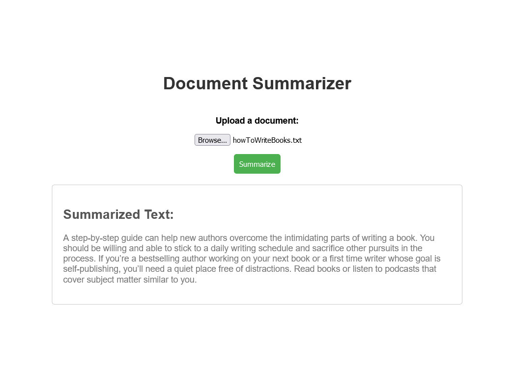

# Document Summarization AI App

## Overview

Welcome to the Document Summarization AI App! This application leverages the FastAPI framework and the Transformers pipeline library for efficient and accurate text summarization. With the power of natural language processing, this app can generate concise and informative summaries from lengthy documents, making it easier for users to extract key information.
## Features

* FastAPI Framework: The application is built on the FastAPI framework, providing high performance and easy-to-use APIs for document summarization.

* Transformers Pipeline Library: We utilize the Transformers pipeline library to integrate state-of-the-art natural language processing models for text summarization, ensuring the best possible summarization results. It uses distilbart-cnn-12–6 model and abstractive summarization technique.
    
    

* Python Regex for Cleaning: Before displaying the summaries, we employ Python regular expressions (regex) to clean and enhance the quality of the generated summaries.

## Screenshots
### Home

The home screen welcomes users and provides a simple interface to upload documents for summarization.
### Summary 1

Here's an example of a document summary generated by the app. The summarization process condenses the document into key points while maintaining the essential information.
### Summary 2

Another example showcasing the app's ability to provide clear and concise summaries for various types of documents.
### API Routes

